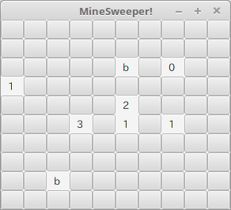
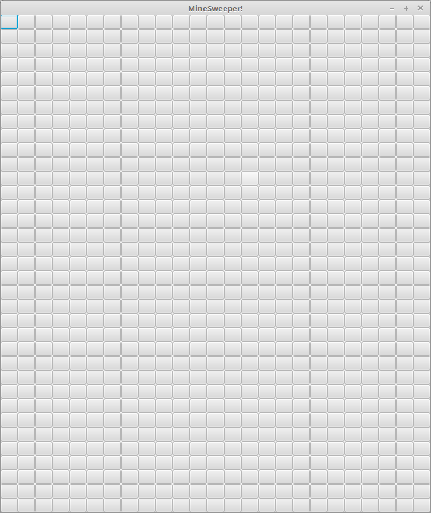
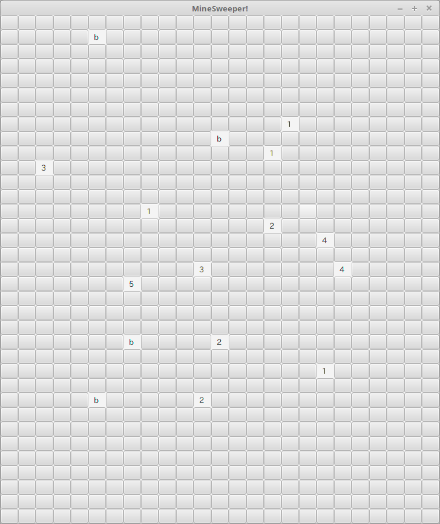

# MineSweeper
Plain MineSweeper

## 就職活動の一環としてJavaでアプリケーションを作りました。

# 使い方
ここでの使い方はlinux mintを想定しています（私の環境がlinux mintのため）。
また、Java実行環境はOracle JRE 8を使う必要があります。OpenJREでは動かないと思います。

```bash
$ git clone https://github.com/steave6/MineSweeper.git
$ java -jar MineSweeper/dist/MineSweeper.jar
```

## 説明
一般的なマインスイーパーを想像していただければと思います。

一言でいうなら、気の聞いていないマインスイーパーです。

### 実際の利用時のスクリーンショットを撮りどのように動作するのか説明していきます。


起動直後の表示です。10x10のマスのマインスイーパーです。



適当にクリックしてみました。


マスの数を変更できます。これは、20x20です。



縦と横のマスの数は自由に設定できます。サイズ変更については、設計を考えた当初から用意に変更・拡張ができるようにと考えて作ったので、簡単に変更できます。



もちろんどれだけ盤面を大きくしようと同じように動作します。


# アプリケーションの自己評価

疲れました。自己評価は後で書きたいと思います。


#　謝辞
ここまで、ご覧頂きありがとうございました。

# 就職活動のために作ったアプリは他にもあります。

https://github.com/steave6/FiboStopWatch

https://github.com/steave6/DaySchedule

