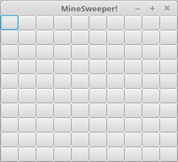
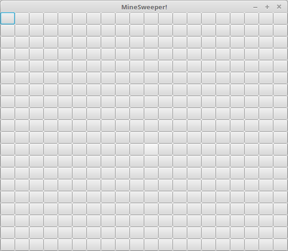
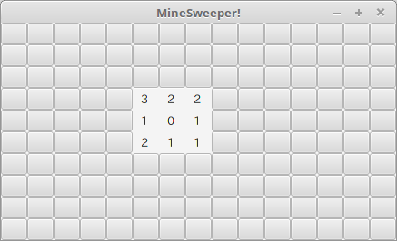
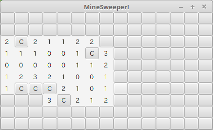
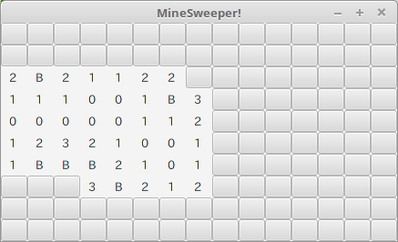

# MineSweeper
Plain MineSweeper

## 就職活動の一環としてJavaでアプリケーションを作りました。

# 使い方
ここでの使い方はlinux mintを想定しています（私の環境がlinux mintのため）。
また、Java実行環境はOracle JRE 8を使う必要があります。OpenJREでは動かないと思います。

```bash
$ git clone https://github.com/steave6/MineSweeper.git
$ java -jar MineSweeper/dist/MineSweeper.jar
```

## 説明
一般的なマインスイーパーを想像していただければと思います。最低限遊べるだけの機能をつけました。

### 実際の利用時のスクリーンショットを撮りどのように動作するのか説明していきます。



起動直後の表示です。10x10のマスのマインスイーパーです。



マスの数はコード一行を変更するだけで自由に変更できます。これは、20x20です。



初めてクリックする場合には必ず0が出るようになっています。また0の場合にはその周辺に爆弾はないので自動的に周囲のマスもクリックし、さらに再帰的に同じ動作を繰り返します。




右クリックでフラグ（画面にあるCの文字）を立てて爆弾の目印をつけることができます。フラグが立っていると左クリックがきかなくなり、誤ってクリックすることを防げます。



フラグを立てたマスをあえてクリックしてみました。下にはB（＝爆弾）があることがわかると思います。これをクリックしてしまえばゲームオーバーとなってしまいます。もっとも、自動的にゲーム終了のメッセージは出ないので自己判断で止めてください。


# アプリケーションの自己評価

就活一環シリーズ第3弾になりますが、自信作です。普通に遊べますし難易度も自由に変更できるので、これからマインスイーパーをする際にはこれを使おうかと思うほどです。

もっとも、コードは全て自作とはいえ、機能自体は通常のマインスイーパーが持っているものをそのまま再現しただけなので真新しさは全くありません。


#　謝辞
ここまで、ご覧頂きありがとうございました。

ひとまず就職活動の一環として作るアプリは3つで十分かと思いますので、シリーズはここで終了といたします。これからはやはりソースコードを読んでもらいたいので、ソースコードに細かなコメントを書いていき、どこでどのように考えたためこのコードを書いたのかをわかるようにしていきたいと考えています。

# 就職活動のために作ったアプリは他にもあります。

https://github.com/steave6/FiboStopWatch

https://github.com/steave6/DaySchedule

